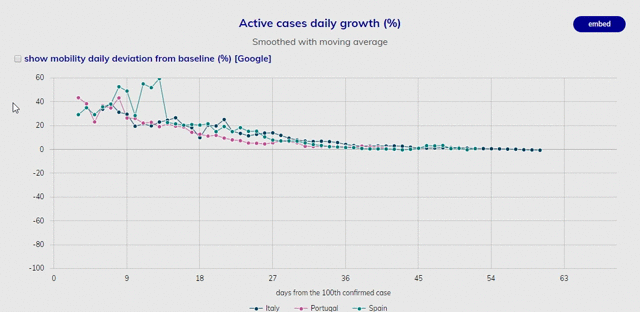

# jsloader
A simple javascript library that creates a loader UI element

Depends on jQuery

##How to

```
jsloader.setColor('#0000FF'); //init jsloader with the color blue
//...
jsloader.showLoader(false,'#my_element'); //show the loader
//do stuff
jsloader.hideLoader('#my_element'); //hide the loader
```

If the ```immediately``` param of ```showLoader``` function is set to ```true```, then the loader will only appear after 500ms. 
If ```hideLoader``` function is called is between, the loader never gets to appear, avoiding an unneeded "flash" for fast tasks.
<br/>If no ```container``` param is passed to the show/hide functions, the library assumes the DOM body as the container and the loader will occupy the entire page.


###Example:
<div align="center">
	
</div>